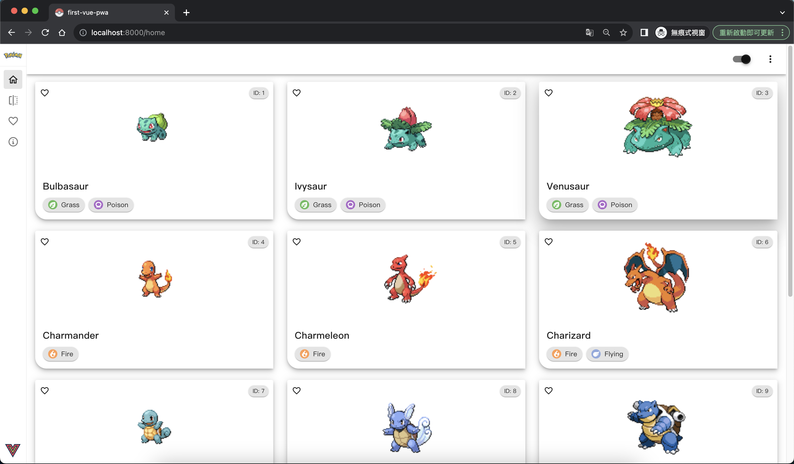
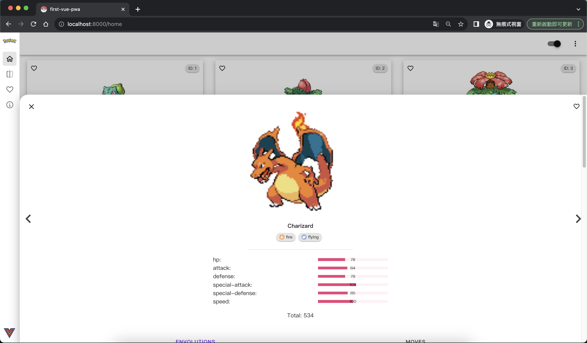
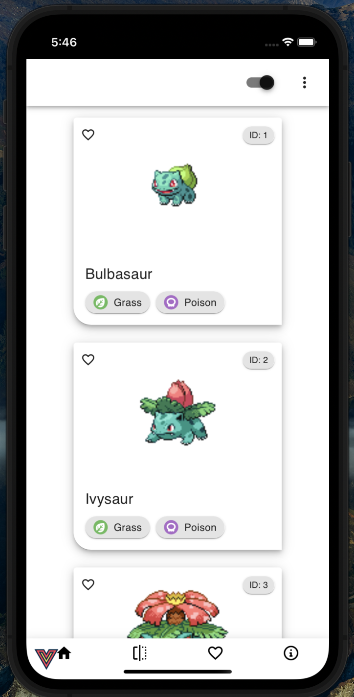
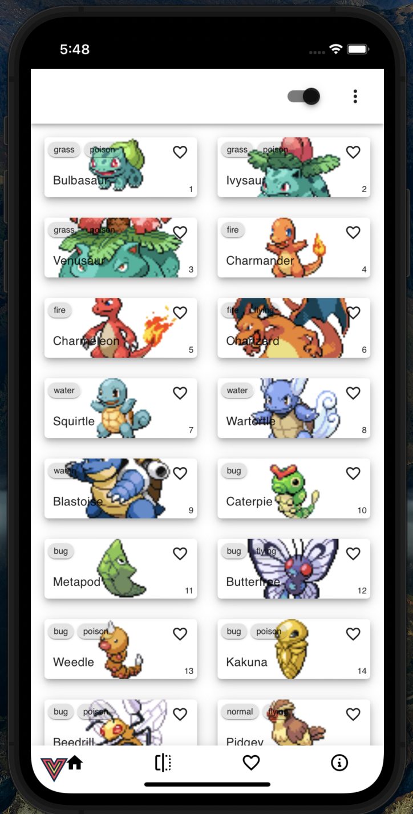
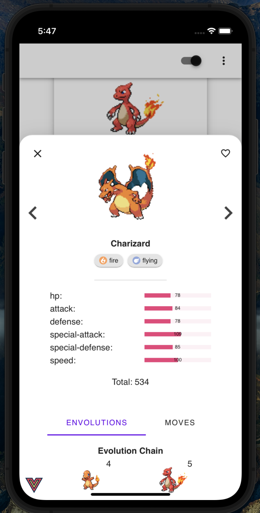

# pokedex-vue-pwa

## Introduation
This project is a PokeDex Progressive Web App that uses the [PokeAPI](https://pokeapi.co/) to get information about pokemon.

The pokedex is deployed on vercel: 

<br/>

## Library

- [Vue3](https://vuejs.org/) composition api
- [Vuetify](https://vuetifyjs.com/en/) for ui component 
- [Pinia](https://pinia.vuejs.org/) for store management 
- [Vue Router](https://router.vuejs.org/) for router

<br/>

## Desktop browser preview
<div style='display: flex;'>


</div>

<br/>

## Phone Progressive web app preview
<div style='display: flex;'>



</div>

<br/>


## Phone browser
The presence of a bottom navigation bar will be absent.

<br/>

## Project setup
```
yarn install
```

### Compiles and hot-reloads for development
```
yarn serve
```

### Compiles and minifies for production
```
yarn build
```

<br/>
<br/>

## Author

Jagadwp