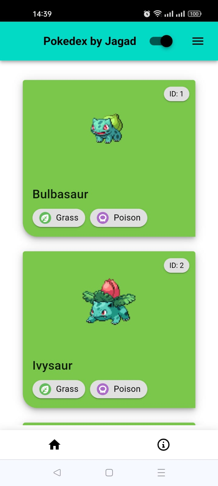
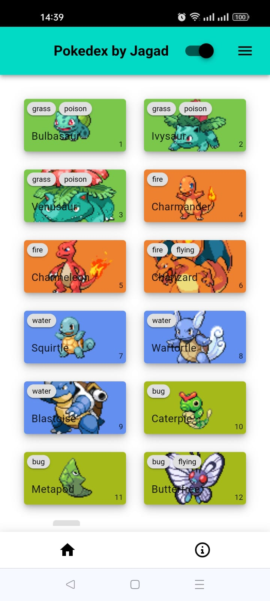
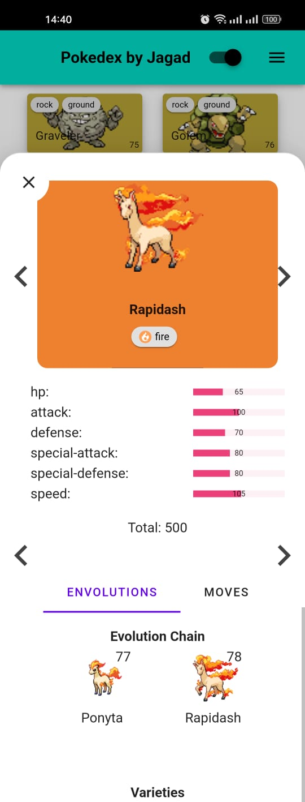

# Pokedex PWA

## Introduction
This is a Progressive Web App (PWA) Pokedex built using Vue.js, designed with a mobile-responsive layout for a smooth experience on all screen sizes. It fetches real-time Pokémon data from the PokeAPI.

👉 You can try it live here: https://pokedex-pwa-jagadwp.vercel.app/
<br/>

## Library
- [Vue3](https://vuejs.org/) composition api
- [Vuetify](https://vuetifyjs.com/en/) for ui component 
- [Pinia](https://pinia.vuejs.org/) for store management 
- [Vue Router](https://router.vuejs.org/) for router

### My Development Environment 
- Node v18.20.8
- Yarn v1.22.11

<br/>

## Desktop Browser Preview
<div style='display: flex;'>

<br/>
<br/>

<br/>
<br/>

</div>

<br/>

## Phone Progressive Web App Preview
<div style='display: flex;'>



</div>

<br/>

## Project Setup
```
yarn install
```

### Compiles & Use Hot-Reloads for Development
```
yarn serve
```

### Compiles & Minifies for Production
```
yarn build
```

<br/>

## 🧑‍💻 Author

Jagadwp